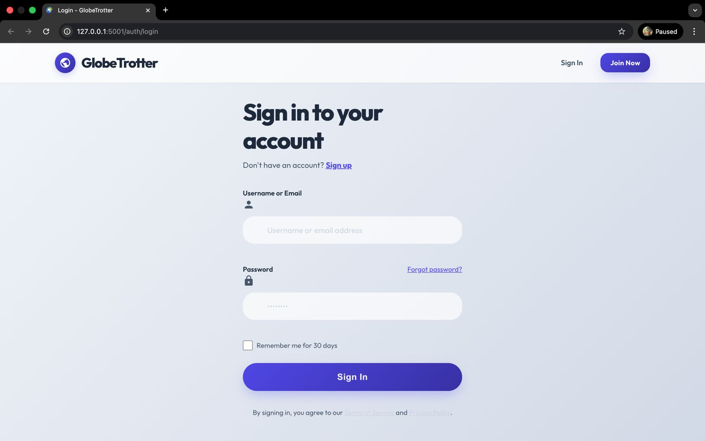
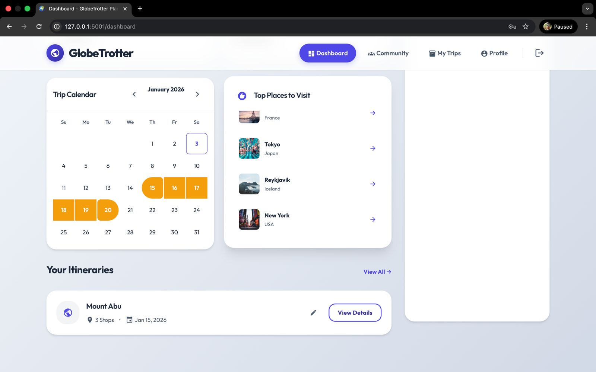
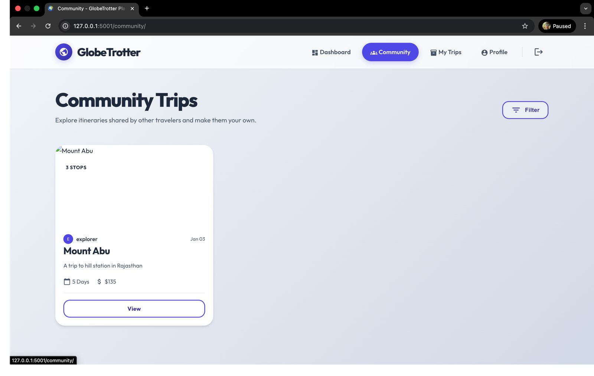

# GlobeTrotter - Premium Travel Planning

GlobeTrotter is a modern, feature-rich travel planning application built with Flask. It features a premium Glassmorphism design system, AI-powered recommendations, and advanced budget tracking.

## 🌟 Key Features

- **🔐 Authentication**: Secure login/signup with session management
- **🏠 Dashboard**: Central hub with trip calendar, top destinations, and quick access
- **✈️ Trip Management**: Create, edit, and organize trips with stops and activities
- **🗺️ Itinerary Builder**: Visual timeline with drag-and-drop stop management
- **🎭 AI-Powered Activities**: Get activity suggestions using Tavily API
- **💰 Budget Tracking**: Track estimated vs actual costs with visual analytics
- **🤝 Community**: Browse and clone public trips shared by other travelers
- **👤 User Profiles**: Personalize your account and manage settings
- **🛡️ Admin Dashboard**: User and trip management for administrators

## 📸 Screenshots

### Login Page

Clean and modern login interface with secure authentication.

### Dashboard

Central hub showing trip calendar, top destinations, and your itineraries at a glance.

### My Trips

View and manage all your trips with quick access to edit, view, or delete options.

### Community

Browse public trips shared by other travelers and clone them to your own dashboard.

### Trip Planner

Detailed trip view with timeline, activities, and AI-powered suggestions for each stop.

### Budget Planner

Track your trip expenses with detailed budget allocation and visual analytics showing spending by category.

### Admin Dashboard - Overview

Platform metrics including total users, trips created, destinations, and financial summaries.

### Admin Dashboard - Management

User and trip management interface for administrators to oversee the platform.

## 🎥 Demo

Watch the full demo and explore all features:
**[View Demo on Google Drive](https://drive.google.com/drive/folders/12juQxl_cOdOdxzAi4sSRn0iAyNXvayfX?usp=share_link)**

## 🛠️ Technology Stack

- **Backend**: Python 3, Flask, Flask-Login, Flask-SQLAlchemy
- **Database**: SQLite (Relational DB with foreign key constraints)
- **Frontend**: Jinja2 Templates, Vanilla CSS (Glassmorphism System), JavaScript (ES6)
- **APIs**: Tavily API (for Travel Recommendations)
- **Visualization**: Chart.js

## 🚀 Quick Start

### Prerequisites
- Python 3.8+
- `pip` package manager

### Installation
```bash
# Clone the repository
git clone https://github.com/your-repo/globetrotter.git
cd globetrotter

# Install dependencies
pip install -r requirements.txt
```

### Configuration
Ensure you have a `config.py` file (or set env vars) with:
```python
SECRET_KEY = 'your-secret-key'
TAVILY_API_KEY = 'your-tavily-api-key'
```

### Database Setup
The app will automatically create the DB on first run. To seed initial data (including the Admin account):
```bash
python seed_data.py
```

### Run the Application
```bash
python run.py
```
Visit [http://localhost:5001](http://localhost:5001) in your browser.

## 🔒 Security Features

- **Strict Admin Access**: Admin routes protected by custom decorator
- **CSRF Protection**: Flask-WTF integration
- **Route Guards**: `login_required` decorators on sensitive endpoints
- **Data Validation**: Input sanitization on forms

## 📂 Project Structure

```
globetrotter/
├── app/
│   ├── routes/          # Blueprints (main, auth, trips, admin, community...)
│   ├── templates/       # Jinja2 HTML Templates (modularized)
│   ├── static/          # CSS (variables, glassmorphism) & JS
│   ├── models.py        # SQLAlchemy Database Models
│   └── __init__.py      # App Factory & Extensions Setup
├── instance/            # SQLite Database file
├── seed_data.py         # Data seeding script
└── run.py               # Application Entry Point
```

## 📜 License

MIT License - Created for the Odoo Hackathon 2026.
